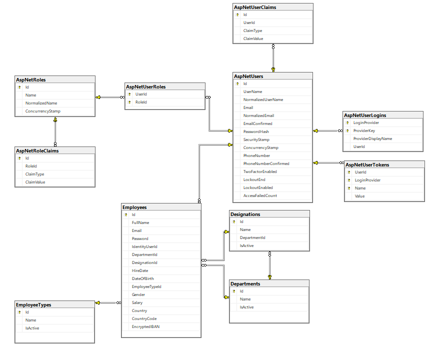

# Human Capital Management Application

## 📄 Overview

This is a **Human Capital Management System** built with **ASP.NET Core MVC**, **Entity Framework Core**, and **ASP.NET Core Identity**. The application provides full CRUD functionality for managing employees with **role-based access control**.

### ✅ Features

- Role-based access for **HR Admin**, **Manager**, and **Employee**
- Authentication and authorization with **ASP.NET Core Identity**
- Employee CRUD operations (Create, Read, Update, Delete)
- Department, Designation, and Employee Type management
- **Pagination**, **search filters**, and **sorting**
- Account seeding based on existing employee data
- Responsive UI with **Bootstrap 5** and **Bootstrap Icons**
- Clear separation of concerns with MVC architecture

---

## 🛠️ Technologies Used

- ASP.NET Core MVC (.NET 8)
- Entity Framework Core with Code-First Migrations
- ASP.NET Core Identity
- SQL Server
- Bootstrap 5 + Bootstrap Icons
- jQuery (for dynamic designations)
- LINQ & Dependency Injection

---

## 🏁 Getting Started

### 1. Clone the repository

```bash
git clone https://github.com/ivoiliev0394/HUMAN-CAPITAL-MANAGEMENT-APPLICATION_UKG.git
cd HUMAN-CAPITAL-MANAGEMENT-APPLICATION_UKG
```

### 2. Configure Database

- In `appsettings.json`, update your connection string:

```json
"ConnectionStrings": {
  "DefaultConnection": "Server=YOUR_SERVER;Database=HumanCapitalManagementAppDatabase;Trusted_Connection=True;TrustServerCertificate=True;"
}
```

### 3. Apply Database Migrations

```bash
dotnet ef database update
```

### 4. Run the Application

```bash
dotnet run
```

Navigate to [https://localhost:5001](https://localhost:5001) in your browser.

---

## 👥 Default Roles and Access Rights

| Role         | Access Level                                                   |
| ------------ | -------------------------------------------------------------- |
| **HR Admin** | Full access to all employees (CRUD)                            |
| **Manager**  | Access to employees in their department (List, Update, Delete) |
| **Employee** | Access to their own profile (Details view only)                |

---

## 🎁 Seeded Accounts

The application auto-generates Identity accounts based on seeded `Employee` data.

| Employee ID | Role     |
| ----------- | -------- |
| 1-2         | HR Admin |
| 3-6         | Manager  |
| 7+          | Employee |

Default passwords are seeded in the database along with Employee data.

---

## 📂 Folder Structure

```
├── Controllers/
├── Data/
├── Models/
├── Services/
├── ViewModels/
├── Views/
└── wwwroot/
```

---

## 📊 Database Schema



---

## 📌 Author

Made by [Ivailo Iliev](https://github.com/ivoiliev0394) | Contact: [ivailo.iliev9999@gmail.com](mailto\:ivailo.iliev9999@gmail.com)

